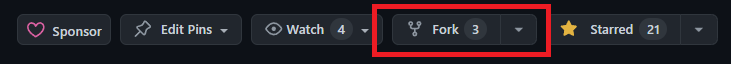
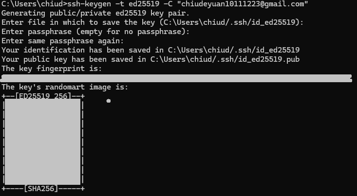

# Git & GitHub
中部電資聯合會議幹訓


---

### 不知道要不要放的自我介紹


<ul style="margin-top: 30px">
    <li>邱德原(De-Yuan, Chiu)</li>
    <li>台中一中電研社教學</li>
    <li>SCAICT 資訊組</li>
    <li>也可以叫我ChiuChiuCircle</li>
    <li style="font-size:35px;">https://chiudeyuan.github.io/</li>    
</ul>

---

### 先備知識
* 基礎cmd使用

---

## 認識Git


--

### Git是一種版本控制器（VCS）
Git由Linus Torvalds開發

<!-- .element: height="400px" -->

--

### 版本控制的好處

* 追踪變更記錄
* 恢復檔案
* 資料備份
* 方便比較差異
* 工作流管理

--

### 分支 Branch


基本上Git的概念就是在開發與合併branch

--

### 冷知識
Git在英國俚語是指"不愉快的人"
因為Linus不爽Bitkeeper(也是VCS)收回他的免費使用權

<!-- .element: height="400px" -->

---

## GitHub


--

### GitHub是用來存放Git的空間
<!-- .element: height="400px" -->

--

### GitHub的好處

* 方便管理專案
* 支持多人協作
* 促進開源風氣

---

## GitHub基本概念

--


--

### 1. Repository
存放程式碼的地方


--

長這樣

<!-- .element: height="400px" -->

--

按New建立新Repo

<!-- .element: height="400px" -->

--

填Repo的一些資料

<!-- .element: height="500px" -->

--

### 2. Clone
將Repository複製到本機以進行修改


--

GitHub上的Repositorty


--

按下"Code"後會有一串網址

我們用這個網址進行clone


--

在cmd使用指令clone

注意"Repo網址"是剛剛的那個網址

不是GitHub頁面的網址
```
git clone [Repo網址]
```

--

clone下來後本機就會多出一個資料夾

<!-- .element: height="400px" -->

--

### 3. Pull
如果本機原本就已經有Repo

能用Pull獲得GitHub上的最新版本


--

在本機的資料夾中的cmd使用指令
```
git pull
```

--

### 4. Fork 
將別人的Repository複製一份給自己

這樣就能在不影響Origin的狀況下自由開發


--

在別人的Repo裡會有這個按鈕



--

按下去就能建立Forked Repo


--

### 5. Push
當修改完程式碼

就能上傳到GitHub上的Repo


--

在本機的資料夾中的cmd使用指令
```
git push
```

--

### 6. Pull Request
如果你是協作他人專案

可以通過PR貢獻自己的code


--

### 6. Pull Request
如果對方覺得你給的code還行

就會把code合併進他們的專案中

並把你列為協作者

---

## Git的使用 | 前置作業

--

### 下載Git

https://www.git-scm.com/downloads

<!-- .element: height="500px" -->

--

可以用指令確認是否安裝成功
```
git --version
```

--

### 與GitHub連線

--

### 一、GitHub Desktop
登入GitHub Desktop就能直接控制Repo

https://desktop.github.com/

<!-- .element: height="500px" -->

--

### 二、使用SSH Key

也能通過SSH Key授權控制Repo

(如果有GitHub Desktop可以不用)

--

#### 1. 在PowerShell輸入生成金鑰指令
```
ssh-keygen -t ed25519 -C "your_email@example.com"
```

--

應該會有一些可以設定密碼的選項

還有確認密鑰檔案儲存位置

接著密鑰就生成好了

<!-- .element: height="400px" -->

--

#### 2. 上傳公鑰

因為SSH有公私鑰

我們是要將「公鑰」上傳至GitHub

在儲存密鑰的資料夾中輸入指令
```
cat .\id_ed25519.pub
```

--

我們將整段文字複製起來

從ssh-ed25519一直到email都要


--

到GitHub的setting裡找到SSH設定

<!-- .element: height="500px" -->

--

按下new ssh key後把公鑰貼上就完成了


--

之後clone或push都是使用SSH

<!-- .element: height="500px" -->

---

## Git的使用 | 各種操作

--


+ 初始化資料夾
    * init & remote
    * clone
+ commit
+ branch
+ push
+ pull

--

### 1. init & remote

把一個資料夾設置為git追蹤的對象
```
git init
```

--

但在init後要選擇控制哪個Repo
所以用指令remote

```
git remote add origin [Repo網址]
```

這邊add指的是「新增控制的目標」

origin是remote端的「別稱」

--

<!-- .element: height="700px" -->

--

我們通常將remote端（如GitHub）稱為Origin


--

### 2. clone
使用指令複製Repo至本地
```
git clone [Repo URL]
```


--

### commit
當我們完成修改後

就要把這個版本記錄起來

<!-- .element: height="500px" -->

--

### commit
使用指令
```
git commit -m "something"
```
參數「-m」是指有附加此commit的訊息

後面的「"something"」便是附加訊息

可以讓人一眼看出此版本有什麼改動

--

就能成功紀錄新版本

<!-- .element: height="500px" -->

--

就能成功紀錄新版本

<!-- .element: height="500px" -->

--

### branch & checkout
先前有說過Git可以在不同分支上進行開發


--

使用指令查看目前分支
```
git branch
```

--

星號「*」是用於標示目前在哪一個branch上

<!-- .element: height="500px" -->

--

開啟新分支指令
```
git branch [branch_name]
```

--

開啟新分支

<!-- .element: height="500px" -->

--

開啟新分支

<!-- .element: height="500px" -->

--

再利用checkout切換目前所在branch
```
git checkout [branch_name]
```

--

<!-- .element: height="500px" -->

--

<!-- .element: height="500px" -->

--

### merge
~~Git中的大魔王~~

合併branch

--

當我們在branch上做了一些開發

最後會需要將分支合併起來

<!-- .element: height="500px" -->

--

使用merge指令
```
git merge [被合併branch_name]
```

--

但要注意在合併前要先在正確的branch

<!-- .element: height="500px" -->

--

例如要將B merge到main

<!-- .element: height="500px" -->

--

就要先checkout到main上

<!-- .element: height="500px" -->

--

然後再merge

<!-- .element: height="500px" -->

--

<iframe width="973" height="695" src="https://www.youtube.com/embed/dygYh2qsx64" title="when git merge 😂😂😂 #git #programming memes" frameborder="0" allow="accelerometer; autoplay; clipboard-write; encrypted-media; gyroscope; picture-in-picture; web-share" referrerpolicy="strict-origin-when-cross-origin" allowfullscreen></iframe>

--

### push
完成工作後

要將code上傳至GitHub

--

使用指令
```
git push
```
或
```
git push origin master
```

--

<!-- .element: height="500px" -->

--

<!-- .element: height="500px" -->

--

<!-- .element: height="500px" -->

--

### pull
更新本機上的檔案

--

例如remote端多了一個新的commit

<!-- .element: height="500px" -->

--


使用指令
```
git pull
```

--

檔案就能更新到remote端的版本

<!-- .element: height="500px" -->

---

最後推薦一個學Git的網站
https://learngitbranching.js.org/?locale=zh_TW

---

## 謝謝聆聽

<!-- .element: height="500px" -->

