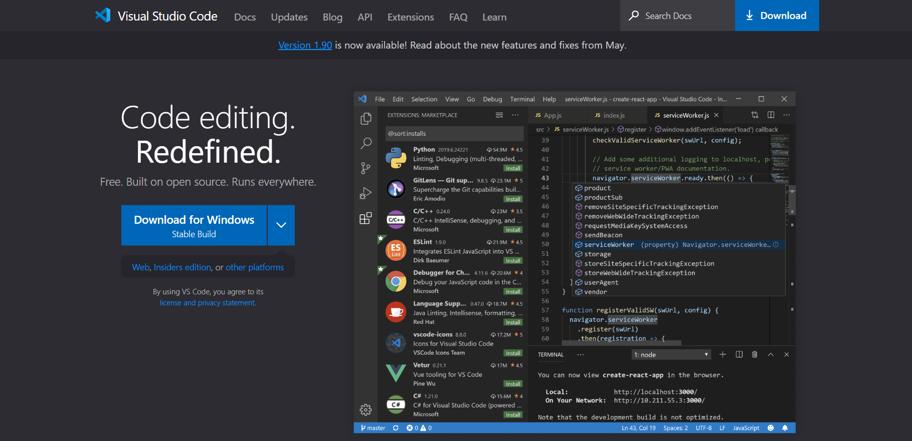
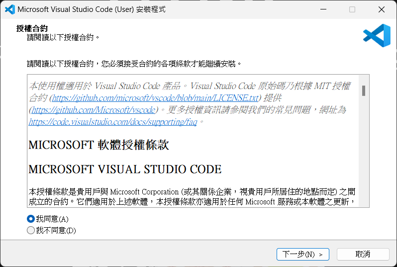
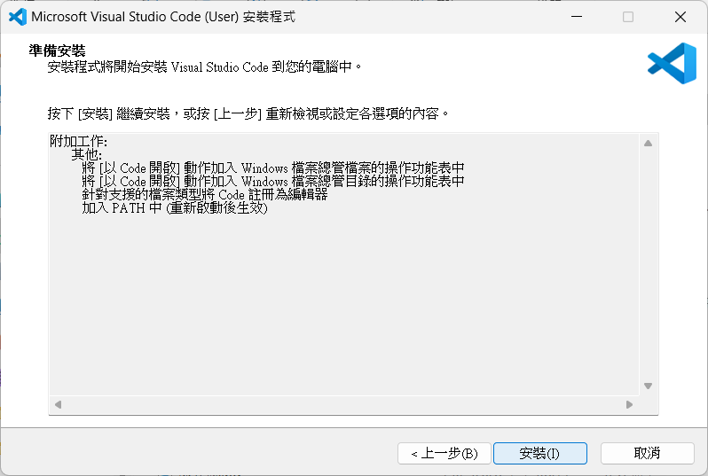
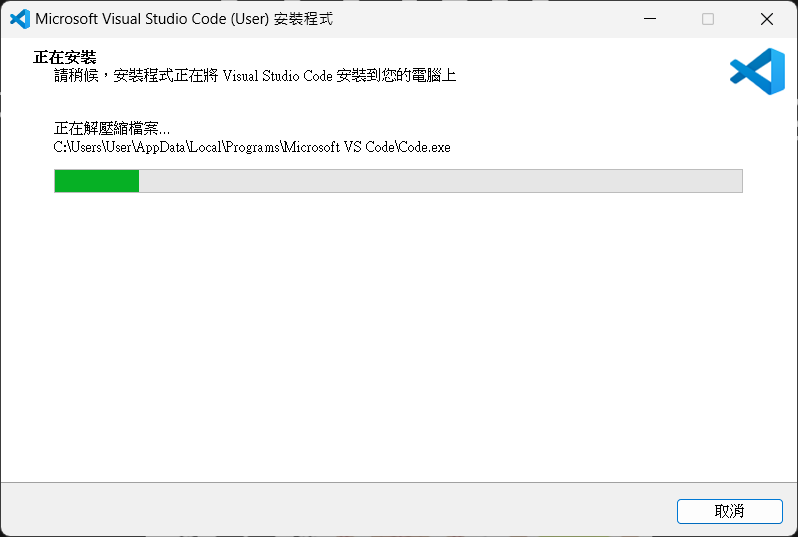
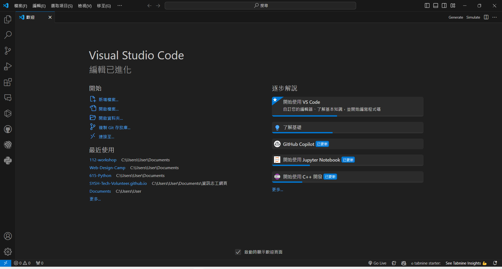
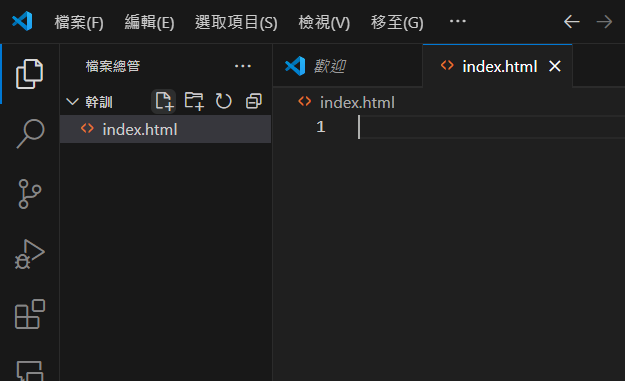
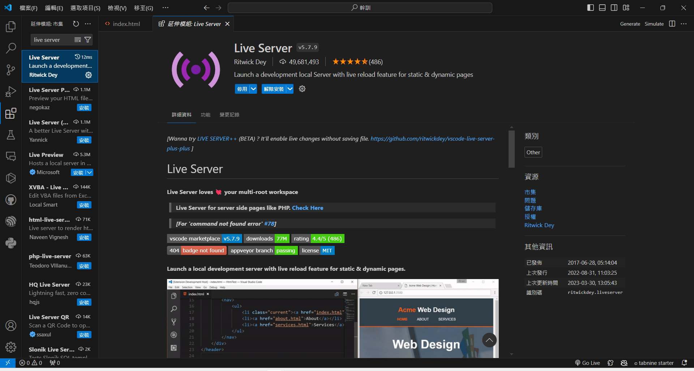
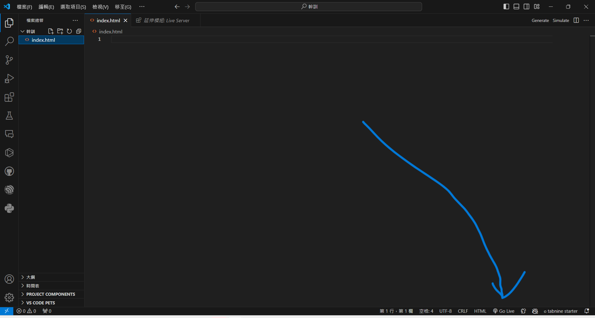

# 下載vscode

點左邊stable build

---
一直按下一步


---


---


---
安裝完成大概會長這樣


---
1. 按開啟一個資料夾
2. 新增資料夾(快捷鍵:右鍵WF)
3. 在資料夾內新增檔案index.html


---
1. 點左邊第五個延伸模組
2. 下載live server


---
按右下角go live


---
現在你已經有一個網頁
# HTML 教學

---

# 第一個網站

> *網站講白就是一個要用瀏覽器打開的Word檔*

但是只有純文字太無聊了，所以我們在文字間做一些標記讓他們有不一樣的意義

---

# HTML

超文本標記語言 HyperText Markup Language  

網站的骨架<br>
 <!-- .element: height="400px" -->

---

# 元素

網站所有東西都是由元素組成
 <!-- .element: style="filter:invert(1);" -->

---

# 文字

```html
<p>段落
  <b>粗體</b>
  <i>斜體</i>
  <s>刪除線</s>
  <u>底線</u>
  H<sup>+</sup>
CO<sub>2</sub>
</p>
```

---

**粗體**
*斜體*
~~刪除線~~
<u>底線</u>
  H<sup>+</sup> CO<sub>2</sub>

---

# 基本架構

```html
<!DOCTYPE html>
<html lang="en">
<html lang="zh-tw">
<head>
  <meta charset="UTF-8">
  <meta http-equiv="X-UA-Compatible" content="IE=edge">
  <meta name="viewport" content="width=device-width, initial-scale=1.0">
  <title>Document</title><!--標題-->
</head>
<body>
  
</body>
</html>
```

# 空白 換行

一個以上的tab、空格、換行都視為一個空格

---

# 插入

```html
橫線<hr />
換行<br />
這兩個是插入一個元素而不是指定範圍，因此習慣後面會用/>結尾。但你要打<br>或<hr>瀏覽器也看得懂
```

---

# 標題

```html
<h1>H1</h1>
<h2>H2</h2>
<h3>H3</h3>
<h4>H4</h4>
<h5>H5</h5>
<h6>H6</h6>
```

---

# H1

## H2

### H3

#### H4

##### H5

###### H6

---

# 無序清單

```html
<ul>
  <li>a</li>
  <li>b</li>
  <li>c</li>
</ul>
```

+ a
+ b
+ c
  
---

# 有序清單

```html
<ol>
  <li>a</li>
  <li>b</li>
  <li>c</li>
</ol>
```

1. a
2. b
3. c
  
---

# 清單裡可以有清單

```html
<ul>
  <li>清單裡可以有清單</li>
  <ul>
    <li>沒錯</li>
    <li>就是這樣</li>
  </ul>
</ul>
```

+ 清單裡可以有清單
  + 沒錯
  + 就是這樣

---

# 超連結

### 格式

```html
<a href="連結">顯示文字</a>
```
### 範例
```html
<a href="https://www.google.com">Goolge</a>
```

[Google](https://www.google.com)

---
# 絕對路徑與相對路徑
### 絕對路徑: 
這個檔案在本機端或是網路上的絕對位置
### 相對路徑:
相對於這個檔案的位置


---

# 圖片

## 格式

```html

```

## 範例

```html

```


---

# 表格

<div style="display:flex; justify-content:space-around;">

```html
<table>
  <tr>
     <th>表格名</th>
    <td>國家</td>
    <td>首都</td>
 
  </tr>
  <tr>
    <td>USA</td>
    <td>Washington D.C.</td>

  </tr>
  <tr>
    <td>Sweden</td>
    <td>Stockholm</td>

  </tr>
</table>
</table>
```

<table style="margin-left:1rem;width:40%;">
  <tr>
   <th>表格名</th>
    <td>國家</td>
    <td>首都</td>
    <td>人口</td>
    <td>語言</td>
  </tr>
  <tr>
    <td>USA</td>
    <td>Washington D.C.</td>
    <td>309 million</td>
    <td>English</td>
  </tr>
  <tr>
    <td>Sweden</td>
    <td>Stockholm</td>
    <td>9 million</td>
    <td>Swedish</td>
  </tr>
</table>

---

# 輸入

```html
<input type="number"
       step="10"
       min="0"
       max="1000">
```

---

```html
<input type="radio" name="color" value="red"> red<br>
<input type="radio" name="color" value="green"> green<br>
<input type="radio" name="color" value="blue"> blue

```

---

```html
<input type="checkbox" checked> Subscribe to newsletter
<input type="checkbox"> Subscribe to newsletter
```

---

# 區塊元素&行內元素

區塊元素:都會另起一行；高度，行高以及頂和底邊距都可控制
eg`div` `p` `h1~h6` `ul` `ol` `li`

行內元素:都會排在同一行直到沒空位才換行，寬度隨內容變化
eg`span` `em` `b` `strong` `img` `input` `br`
